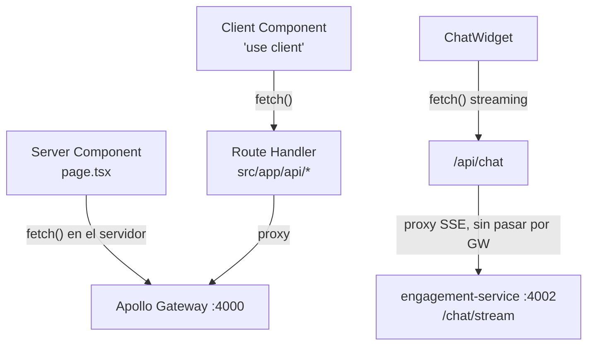

# Frontend de Centinela Dental — Arquitectura

Next.js 16 (App Router) sobre React 19: catálogo, asistente de chat en vivo, inbox de
escalaciones y captura de leads — todo consumiendo un único gateway GraphQL, con componentes de
servidor por defecto y cliente solo donde hay interacción real.

**Repo:** `centinela-frontend` · **Stack:** Next.js 16 · React 19 · TypeScript · Tailwind v4 ·
shadcn/base-ui · **Runtime:** Node 24 (Tailwind v4 lo exige)

---

## 1. Rutas: once páginas, un solo patrón de shell

Toda página parte del mismo contenedor (`max-w-3xl` para texto, `max-w-6xl` para grillas) y por
defecto es un Server Component async que llama al gateway directamente — el cliente solo entra
donde hay estado o interacción.

| Ruta | Tipo | Fuente de datos |
|---|---|---|
| `/` | server | categorías + `LeadCaptureForm` (client) |
| `/catalog` | server | productos + categorías |
| `/catalog/[category]` | server | productos filtrados por categoría |
| `/catalog/product/[sku]` | server | detalle de producto |
| `/inbox` | server | tickets de escalación |
| `/inbox/[ticketId]` | server | transcripción + `ResolveTicketButton` (client) |
| `/leads` | server | lista de leads |
| `/leads/[leadId]` | server | detalle + estado de consentimiento (client) |
| `/faq` | server | contenido estático (Accordion) |
| `/contacto` | server | info estática + `LeadCaptureForm` (client) |
| `/politicas` | server | contenido estático (Tabs) |

---

## 2. Flujo: dos caminos hacia el gateway

Los Server Components llaman al gateway directo en el servidor. Los Client Components nunca lo
tocan — pasan por un Route Handler propio que actúa de proxy delgado, para no exponer el gateway
al navegador ni duplicar lógica de red.

*El streaming del chat evita el gateway por la misma razón que en el backend: SSE no encaja en
una sola respuesta GraphQL.*

| Route Handler | Método | Reenvía a |
|---|---|---|
| `/api/chat` | POST | SSE de `engagement-service` |
| `/api/inbox/[ticketId]/resolve` | POST | mutation `resolveEscalationTicket` |
| `/api/leads` | POST | mutation `createLead` |
| `/api/leads/[leadId]/status` | POST | mutation `updateLeadStatus` |
| `/api/leads/[leadId]/consent/revoke` | POST | mutation `revokeLeadConsent` |

---

## 3. Sistema: componentes, tema y el punto de quiebre del nav

`shadcn/ui` está instalado en su variante `base-nova`, respaldada por `@base-ui/react` — no
Radix. Eso cambia APIs puntuales que la mayoría de ejemplos online asumen: `Button` usa una prop
`render` en vez de `asChild`, `Select`/`Accordion` trabajan con arrays de valor en vez de un
string único.

El modo claro/oscuro corre por `next-themes` con `attribute="class"`, conmutando la clase `dark`
que ya esperaban los tokens de color en `globals.css`.

### El nav que creció de 2 a 6 enlaces

El header nació con `sm:flex` (640px) para 2 enlaces. Cada página nueva (Leads, FAQ, Contacto,
Políticas) sumó un enlace más, hasta que a 645px el texto empezó a envolver en dos líneas —
incluso el nombre de la marca. Se verificó con capturas reales en el punto de quiebre, no se
asumió: el umbral se subió a `md:` (768px) y el trigger del menú móvil se sincronizó al mismo
breakpoint.

| Escenario | `sm:` (640px) | `md:` (768px) |
|---|---|---|
| 2 enlaces | ✓ | — |
| 6 enlaces | ✗ (envuelve texto) | ✓ |

---

## 4. Bitácora: tres bugs que parecían funcionar

Cada uno pasó una primera verificación visual antes de romperse en un caso real.

- **`next/image` — las imágenes del catálogo devolvían 200 con bytes JPEG válidos pero se veían
  en blanco.** Causa: el optimizador de imágenes de Next.js pone `Content-Disposition: attachment`
  por defecto, y algunos contextos del navegador se niegan a pintarlo inline. Corregido con
  `images.contentDispositionType: "inline"` en `next.config.ts`.

- **Lazy loading — en `/catalog`, cero peticiones de red se disparaban para ninguna imagen**, ni
  las que estaban arriba del pliegue. El disparador de lazy-load basado en `IntersectionObserver`
  no se activaba de forma confiable. Next.js ya había insinuado la solución en sus propios logs de
  LCP: `priority` en las primeras 6 tarjetas, que evita depender del observer por completo.

- **CSS overflow — un `overflow-x-auto` sin `overflow-y` explícito generó una barra de scroll
  vertical fantasma** en el `TabsList` de `/politicas` — regla real del spec de CSS: si un eje
  deja de ser `visible`, el otro se fuerza a `auto`. Corregido fijando `overflow-y-hidden` junto
  al eje X.

---

*Centinela Dental — distribuidor autorizado de FGM Dental Group en Colombia. Documento generado a
partir del estado real del repositorio.*
