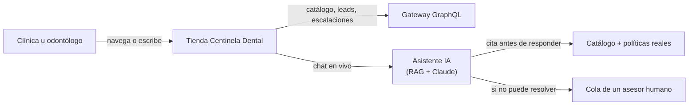

# Centinela Dental — Resumen del proyecto

Decenas de pymes comparten el mismo dolor: la atención al cliente las desborda. Las mismas
preguntas de precio, disponibilidad y recomendación llegan por todos los canales a la vez, y la
calidad de la respuesta depende de quién esté disponible en ese momento. **Centinela Dental** es
la tienda B2B y el asistente de atención de un distribuidor autorizado de FGM Dental Group en
Colombia, construidos para que esa respuesta no dependa de quién esté de turno.

---

## Qué construimos

Cinco capacidades reales, no mockups — cada una corriendo contra datos sembrados y un pipeline
funcional.

- **Catálogo profesional** — 19 productos originales en 9 líneas FGM (blanqueamiento, implantes,
  resinas, CAD/CAM…), con precios en COP, disponibilidad e imagen por SKU.
- **Asistente con memoria de marca** — responde citando la política real de envíos, garantía y
  pago del negocio; nunca improvisa una cifra que no esté en la base de conocimiento.
- **Recomendación clínica** — ante una necesidad descrita en lenguaje natural ("sensibilidad
  post-blanqueamiento"), sugiere el producto correcto con una tarjeta citable, no texto suelto.
- **Escalación a un humano** — cuando el asistente no puede resolver algo, abre un ticket visible
  en un inbox real, con la transcripción completa y las fuentes citadas.
- **Leads con consentimiento** — captura de contacto con opt-in explícito por canal
  (email/SMS/WhatsApp) y revocación sin fricción: cumplimiento, no solo formulario.

---

## Cómo encaja

Una tienda, un gateway, un asistente que nunca responde a ciegas.

Ver el detalle de implementación en `backend-architecture.md`, `graphql-api-reference.md` y
`frontend-architecture.md`.

---

## Qué queda deliberadamente afuera

Alcance elegido para este corte, no una lista de pendientes olvidados.

- **Cuentas y checkout reales.** No hay login ni pasarela de pago — el flujo de compra en línea
  queda para una fase posterior, junto con inventario en tiempo real.
- **Envío real de marketing.** Los adaptadores de email/SMS/WhatsApp/ads existen y compilan, pero
  ninguna mutación dispara un envío o una campaña paga sin credenciales reales y aprobación
  humana explícita.
- **Despliegue en la nube.** Todo corre en `localhost` hoy — cada servicio ya lee su
  configuración por variables de entorno y tiene su propio `Dockerfile`, así que el salto no
  exige reescribir lógica de negocio.

---

## Estado actual

| Métrica | Valor |
|---|---|
| Microservicios + gateway | 4 |
| SKUs sembrados | 19 |
| Páginas en el frontend | 11 |
| Disponibilidad del asistente | 24/7 |

---

*Centinela Dental — distribuidor autorizado de FGM Dental Group en Colombia.*
